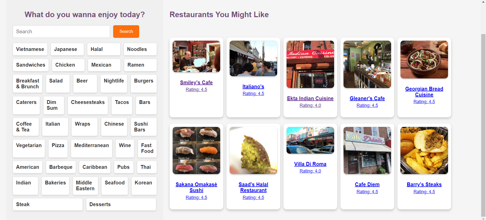

# Restaurant Recommender System


This Restaurant Recommender System is designed to provide personalized restaurant recommendations to users based on their preferences and restaurant features. It combines collaborative filtering and content-based filtering techniques to offer a comprehensive and user-friendly restaurant discovery experience.

## Table of Contents

1. [Introduction](#introduction)
2. [Features](#features)
3. [Getting Started](#getting-started)
    - [Dataset](#dataset)
    - [Notebooks](#notebooks)
4. [Deployment](#deployment)
5. [Usage](#usage)
    - [User Sign-in](#user-sign-in)
    - [Top Recommendations](#top-recommendations)
    - [Search by Cuisine](#search-by-cuisine)
    - [Restaurant Details](#restaurant-details)

## Introduction

The Restaurant Recommender System is built using a combination of collaborative filtering and content-based filtering methods, offering a balanced approach to restaurant recommendations. Users can sign in to personalize their experience, explore top recommendations, search for restaurants by cuisine, and access detailed information about each restaurant.

## Features

- **User Sign-in:** Users can sign in to receive personalized recommendations based on their preferences.

- **Collaborative Filtering:** Recommends restaurants based on user behavior and preferences, utilizing the Yelp dataset for reviews.

- **Content-Based Filtering:** Utilizes restaurant descriptions and facilities to provide recommendations based on the features of the restaurant itself.

- **Search Functionality:** Allows users to search for restaurants by cuisine, making it easy to find restaurants that match specific preferences.

- **Restaurant Details:** Provides detailed information about each restaurant, including user reviews, ratings, and relevant location-based data.

## Getting Started

### Dataset

This system uses the Yelp dataset, focusing on restaurant businesses in Philadelphia. The dataset includes information on user reviews, business details, and more. You can obtain the dataset by following the [Yelp Dataset](https://www.yelp.com/dataset) Documentation.

### Notebooks

1. **Preprocessing**: This notebook focuses on data preprocessing and filtering. It is designed to work with the Yelp dataset but specifically targets a city of your choice, in this case, Philadelphia. Preprocessing often involves selecting relevant data, cleaning, and transforming it for later use in your recommender system. Here's what you can typically find in this notebook:
    - Data Filtering: Restaurants in the chosen city (Philadelphia) are selected.
    - Data Cleaning: Removing duplicates, and removing users with fewer review counts.
      
2. **Collaborative Filtering**: In this notebook, you implement the collaborative filtering technique, specifically using a Neural Collaborative Filtering (NCF) approach. Collaborative filtering is a recommendation method that relies on user-item interactions and user behavior. The NCF algorithm leverages neural networks to enhance recommendation accuracy. The key components of this notebook may include:
    - Model Building: Building a neural network model for collaborative filtering.
    - Training: Training the model using the preprocessed data.
    - Evaluation: Assessing the model's performance using metrics such as Mean Absolute Error (MAE).
    - Recommendations: Generating restaurant recommendations for users based on their behavior.
      
3. **Content-Based Filtering**: This notebook focuses on content-based filtering, a recommendation technique that considers the attributes and features of items (in this case, restaurants) and matches them with users' preferences. The primary content for recommendation is typically derived from the descriptions, facilities, or other textual information about restaurants. The key contents of this notebook are:
    - Feature Extraction: Extracting relevant features from restaurant descriptions and facilities.
    - Feature Engineering: Preprocessing and structuring the features which involves techniques like TF-IDF.
    - Cosine Similarity: Using cosine similarity to get the similarity score between two restaurants.
  
## Deployment
The Restaurant Recommender System web-app is be deployed as a Flask web application. Users can access the system through a web browser.
```
python app.py
```

## Usage

### User Sign-in


### Top Recommendations
Once the user signs in, the collaborative filtering model gives a list of recommended restaurants.


### Search by Cuisine
The user can also search for a specific restaurant based on his mood.


### Restaurant Details
On selecting a particular restaurant, the backend gives a list of a few restaurants based on content similarity. From this list, another curated list of restaurants is picked based on a collaborative model. Finally, the details of the restaurant are shown as well.


